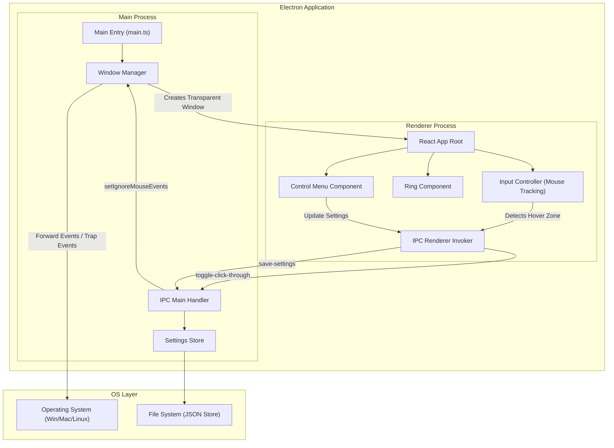
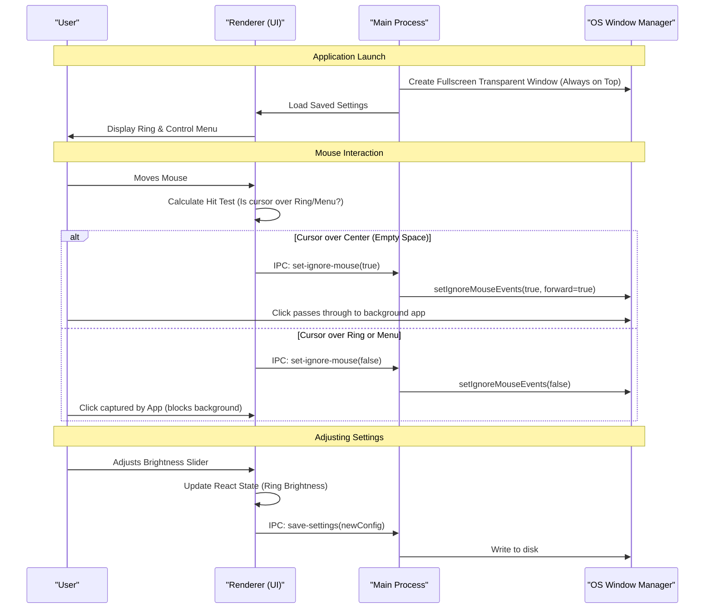

# System Design

## 1. High-Level Architecture

- **Pattern**: Desktop Monolith (Electron Framework)
- **Description**: 
  The application utilizes the **Electron** framework to bridge web technologies (React, TypeScript) with native OS capabilities. This ensures cross-platform compatibility (Windows, macOS, Linux) and access to low-level window management required for overlays.
  
  The system consists of two primary processes:
  1.  **Main Process (Node.js)**: Responsible for application lifecycle, creating the browser window, handling system tray integration, persisting user settings via the file system (`electron-store`), and managing window transparency/click-through states via IPC (Inter-Process Communication).
  2.  **Renderer Process (React SPA)**: Renders the UI (Ring overlay and Control Panel). It calculates mouse position relative to visual elements to dynamically instruct the Main Process whether to capture or forward mouse events to the underlying operating system.

### Architecture Diagram



## 2. User Flow Architecture

- **Critical Path**:
  1.  **Launch**: App starts, loads persisted settings, and opens a fullscreen transparent window 'always-on-top'.
  2.  **Idle**: The Ring is visible. The center is transparent.
  3.  **Interaction (Pass-through)**: User moves mouse to the center of the ring. The app detects the cursor is over a "safe zone" and enables mouse forwarding. The user clicks a browser window behind the app.
  4.  **Interaction (Blocking)**: User moves mouse over the actual ring pixels. The app detects the cursor is over an "active zone" and disables mouse forwarding. The user clicks the ring (nothing happens behind it).
  5.  **Adjustment**: User clicks the floating Control Menu. Changes brightness/color. State updates immediately.
  6.  **Termination**: User clicks "Quit" in Control Menu or System Tray. Settings save. App closes.

### User Flow Diagram



## 3. File Structure

The project follows a standard Electron-Vite-TypeScript structure.

```text
root/
├── electron/
│   ├── main/
│   │   ├── index.ts           # Main process entry point
│   │   ├── windowManager.ts   # Window creation & config logic
│   │   └── ipcHandlers.ts     # Definition of IPC listeners
│   ├── preload/
│   │   └── index.ts           # ContextBridge exposure
│   └── tsconfig.json
├── src/                       # Renderer Process (React)
│   ├── assets/
│   ├── components/
│   │   ├── RingOverlay.tsx    # SVG/Div implementation of the Ring
│   │   ├── ControlPanel.tsx   # Floating settings menu
│   │   └── ColorPicker.tsx    # Helper component
│   ├── hooks/
│   │   ├── useMouseTrap.ts    # Logic for detecting mouse position & IPC calls
│   │   └── useSettings.ts     # Store interaction hook
│   ├── types/
│   │   └── settings.d.ts      # TypeScript interfaces
│   ├── App.tsx
│   ├── main.tsx
│   └── index.css              # Global styles (Tailwind directives)
├── electron-builder.json5     # Build configuration
├── package.json
├── tailwind.config.js
├── tsconfig.json
└── vite.config.ts
```

## 4. Data Models & Interfaces

### Settings Interface
Defines the state persisted to disk and shared between processes.

```typescript
// src/types/settings.d.ts

export interface RingGeometry {
  size: number;         // Diameter in pixels or viewport percentage
  thickness: number;    // Width of the ring band
  blur: number;         // CSS blur filter amount (px)
}

export interface RingAppearance {
  color: string;        // Hex code or RGBA
  brightness: number;   // 0.0 to 1.0 (Opacity or HSL lightness)
  isOn: boolean;        // Power state
}

export interface AppSettings {
  geometry: RingGeometry;
  appearance: RingAppearance;
  controlPanelPosition: { x: number; y: number }; // Coordinates for floating menu
  monitorId: number;    // ID of the display to project on
}

export interface IpcApi {
  setIgnoreMouse: (ignore: boolean) => void;
  saveSettings: (settings: AppSettings) => void;
  getSettings: () => Promise<AppSettings>;
  quitApp: () => void;
}
```

## 5. Component Design

### 1. `App` (Container)
- **Responsibility**: Layout container. Holds the global state for `AppSettings`.
- **Hooks**: `useSettings` (loads initial state), `useMouseTrap` (global mouse tracking).
- **Render**: Renders a fullscreen `div` (pointer-events-none by default) containing `RingOverlay` and `ControlPanel` (pointer-events-auto).

### 2. `RingOverlay`
- **Responsibility**: Visual representation of the light.
- **Props**: `geometry: RingGeometry`, `appearance: RingAppearance`.
- **Implementation**:
  - Uses an SVG or CSS `border-radius` div centered in the screen.
  - Applies a glowing `box-shadow` or SVG filter based on `blur` prop.
  - **Interaction**: The element itself has `pointer-events: auto`. This allows the `useMouseTrap` hook to detect hover events on the ring pixels specifically.

### 3. `ControlPanel`
- **Responsibility**: User interface to modify settings.
- **Props**: `settings: AppSettings`, `onUpdate: (s: AppSettings) => void`.
- **State**: Local state for form inputs before committing (optional) or direct controlled inputs.
- **UI Elements**:
  - Toggle Switch (Power).
  - Sliders: Size, Thickness, Blur, Brightness.
  - Color Picker: Preset swatches + Custom Hex.
  - Drag Handle: Allows moving the panel around the screen.

### 4. `useMouseTrap` (Custom Hook)
- **Responsibility**: Critical performance logic.
- **Logic**:
  - Adds event listener for `mousemove` on `window`.
  - Checks `document.elementFromPoint(x, y)`.
  - If the element is the "Root Container" or "Safe Zone", invoke `window.electron.setIgnoreMouse(true)`.
  - If the element is "Ring" or "ControlPanel", invoke `window.electron.setIgnoreMouse(false)`.
  - **Optimization**: Only send IPC message if the state *changes* (debounce/throttle not recommended for edge detection, but state diffing is required).

## 6. API/Interface Design

### IPC Channels (Main <-> Renderer)

#### `ipcMain.handle('get-settings')`
- **Method**: GET
- **Response**: `AppSettings` object loaded from disk.

#### `ipcMain.on('save-settings')`
- **Method**: POST (Fire and forget)
- **Payload**: `Partial<AppSettings>`
- **Action**: Merges with current store and writes to JSON file.

#### `ipcMain.on('set-ignore-mouse')`
- **Method**: POST
- **Payload**: `boolean` (ignore)
- **Action**:
  ```typescript
  if (ignore) {
    mainWindow.setIgnoreMouseEvents(true, { forward: true });
  } else {
    mainWindow.setIgnoreMouseEvents(false);
  }
  ```
  *Note: `forward: true` is essential for Windows/macOS to allow click-through.*

#### `ipcMain.on('quit-app')`
- **Method**: POST
- **Action**: Gracefully closes the application.

### Window Configuration (Main Process)
- **Class**: `BrowserWindow`
- **Config**:
  ```javascript
  {
    transparent: true,
    frame: false,
    fullscreen: true, // Or maximizes to specific display bounds
    alwaysOnTop: true,
    hasShadow: false,
    skipTaskbar: false, // User preference
    webPreferences: {
      preload: preloadPath,
      nodeIntegration: false,
      contextIsolation: true
    }
  }
  ```